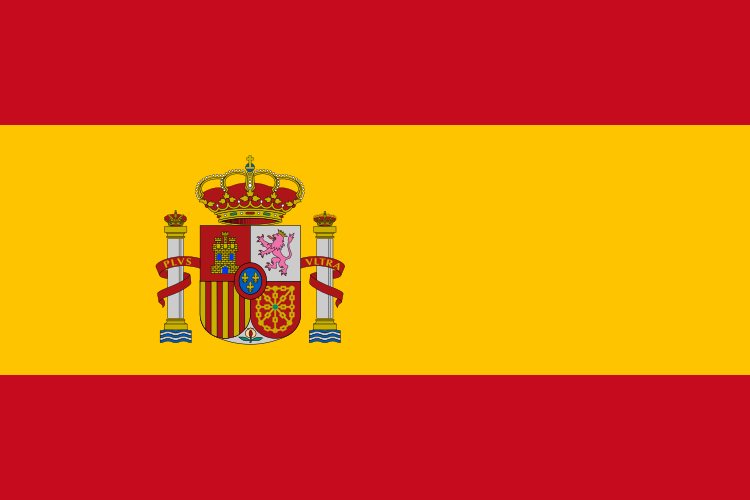
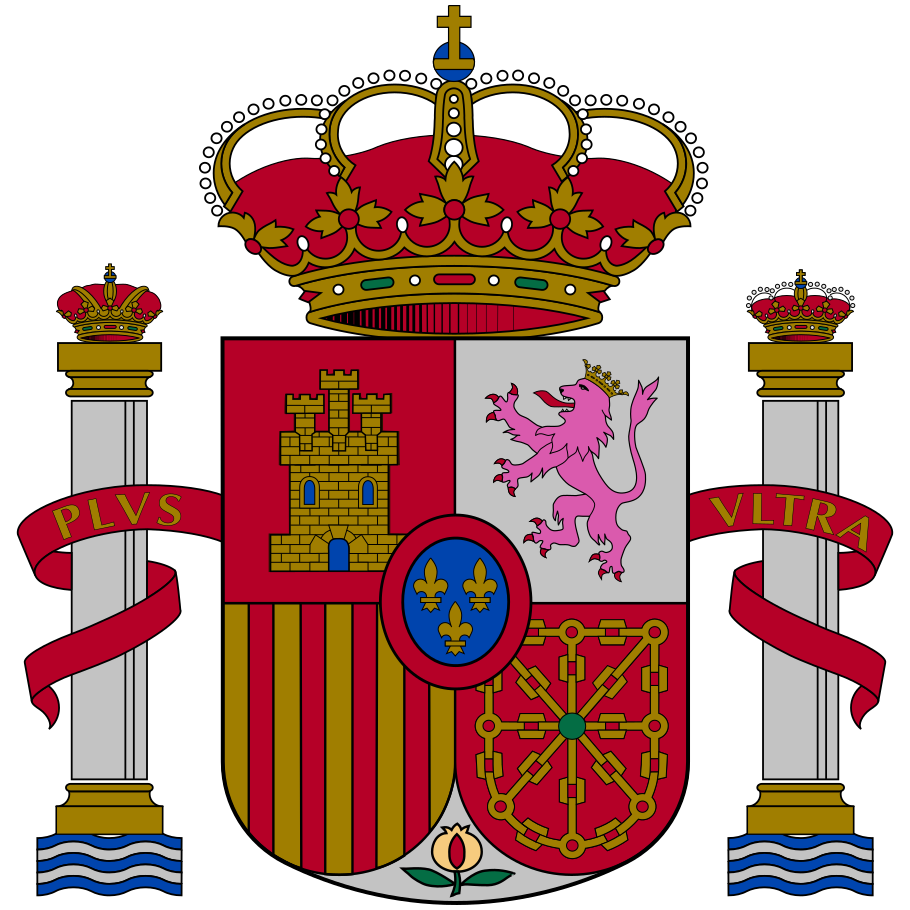

---
aliases:
  - Spain
  - España
  - Espagne
  - إسبانيا
  - 西班牙
  - Испания
  - the Kingdom of Spain
  - el Reino de España
  - ReadMe
has_id_wikidata: Q29
title: Spain
linkTitle: ""
type: Country
location:
  - 40.0911
  - -2.86673
SpocWebEntityId: 26889
tags:
  - geo/Country
isDeleted: false
confidential: public
license: CC BY-SA 4.0
isReadOnly: false
source: https://datahub.io/core/country-codes
cssclasses:
  - Country
publish: true
keywords: ""
layout: ""
draft: false
publishDate: ""
expiryDate: ""
Languages:
  - es-ES
  - ca
  - gl
  - eu
  - oc
icon: flag-es
dv_has_name: Spain
dv_has_name_en: Spain
dv_has_name_es: España
dv_has_name_fr: Espagne
dv_has_name_cn: 西班牙
dv_has_name_ar: إسبانيا
dv_has_name_ru: Испания
dv_has_name_de: Spanien
dv_ISO2: ES
dv_ISO3: ESP
dv_has_:
  name_:
  url_for_:
    code_repository: https://github.com/SpocWiki/Europe-Spain
  image_for_:
    flag: "![[./Flag_of_Spain.svg|200]] "
    coat_of_arms: "![[./Escudo_de_España~mazonado.svg|150]] "
  sound_of_:
    anthem: "![[Anthem-Spain-complete.mp3]]"
dv_ISO4217-currency_alphabetic: EUR
dv_ISO4217-currency_name: Euro
dv_ISO4217-currency_numeric: 978
dv_ISO4217-currency_minor_unit: 2
dv_ISO4217-currency_country_name: SPAIN
dv_Telephone: 34
dv_Global: true
dv_Global_Name: World
dv_CLDR_display_name: Spain
dv_UNTERM_English: Spain
dv_UNTERM_English_Formal: the Kingdom of Spain
dv_UNTERM_Spanish_Formal: el Reino de España
dv_UNTERM_Spanish: España
dv_UNTERM_French: Espagne (l') [fém.]
dv_UNTERM_Arabic: إسبانيا
dv_UNTERM_Arabic_Formal: مملكة إسبانيا
dv_UNTERM_Chinese: 西班牙
dv_UNTERM_Chinese_Formal: 西班牙王国
dv_UNTERM_French_Formal: le Royaume d'Espagne
dv_UNTERM_Russian: Испания
dv_UNTERM_Russian_Formal: Королевство Испания
dv_Region_Name: "[[../../../Europe]]"
dv_Intermediate_Region_Name: "[[ReadMe]]"
dv_Sub-region_Name: "[[Southern Europe]]"
dv_Region: 150
dv_Sub-region: 39
dv_Geoname-ID: 2510769
dv_FIPS: SP
dv_FIFA: ESP
dv_IOC: ESP
dv_MARC: sp
dv_GAUL: 229
dv_WMO: SP
dv_ITU: E
dv_DS: E
dv_TLD: .es
dv_EDGAR: U3
dv_M49: 724
dv_is_independent: Yes
dv_Developed_:
  Developing_Countries: Developed
dv_ISO3166-1-numeric: 724
dv_Area-Total: 505990
dv_Area-Land: 499440
dv_has_place_continent: "[[../../../Europe]]"
dv_VehicleCode: E
dv_Capital: "[[Provinces~Spain/Madrid,Region]]"
dv_Alcohol-l: 11.6
dv_Language-Id: 492
dv_is_a_: "[[../../../../Geography/Place]]"
dv_has_place_longitude: -2.86673
dv_has_place_latitude: 40.0911
dv_has_url_for_code_repository: https://github.com/SpocWiki/Europe-Spain
dv_has_image_for_flag: "![[./Flag_of_Spain.svg|200]] "
dv_has_image_for_coat_of_arms: "![[./Escudo_de_España~mazonado.svg|150]] "
dv_has_sound_of_anthem: "![[Anthem-Spain-complete.mp3]]"
dv_developed_developing_countries: Developed
---

# Spain (España)

## International Names


name = `=this.dv_has_name` 
has_name_en = `=this.dv_has_name_en` 
has_name_es = `=this.dv_has_name_es` 
has_name_fr = `=this.dv_has_name_fr` 
has_name_cn = `=this.dv_has_name_cn` 
has_name_ar = `=this.dv_has_name_ar` 
has_name_ru = `=this.dv_has_name_ru` 
has_name_de = `=this.dv_has_name_de` 

ISO2 = `=this.dv_ISO2` 
ISO3 = `=this.dv_ISO3` 

has_url_for_code_repository = `=this.dv_has_url_for_code_repository`

This Repository/Folder/Wiki/Vault contains freely usable Text and Data 
covering the European country of [Spain](https://en.wikipedia.org/wiki/Spain). 

This Repository is intended to be shared as a common basis, 
by including it as a Sub-Repository in local File-Systems, 
specifically as part of the [\_Standards](https://github.com/SpocWiki/_Standards) Repository. 

Check out this Repository into this Subfolder: 
\_Standards/geo/Continent/Europe/Europe~South/Spain 

> Caution: this is a very deep folder Structure with up to 170 Characters! 
> Make sure to check it out into a shallow Location on Windows! 
> 
> If you see an opportunity to reduce this Depth, create an Issue and discuss first, 
> because Changes may break Links or at least require every User 
> to update their local Repos! 
> 
> Constraints to consider when refactoring: 
> - Every Folder Name should be unique, also the grouping-Folders, so you can link to it without specifying the relative Path 
> - all Link-Paths should be relative. Wiki-Links are possible, but only when the Target-Folders or Files have unique Names. 
> - Between each Level and its Sub-Levels there should be a grouping Folder, to allow adding other Lists. 
>   - e.g. a City's boroughs should NOT be directly in the City Folder, but in a Sub-Folder named `City~boroughs` 

### #has_/image_for_/flag 

has_image_for_flag = `=this.dv_has_image_for_flag`

## #has_/text_of_/abstract  


> **Spain**, or the Kingdom of Spain, is a country located in Southwestern Europe, 
> with parts of its territory in the Atlantic Ocean, the Mediterranean Sea and Africa. 
> It is the largest country in Southern Europe 
> and the fourth-most populous European Union member state. 
> Spanning across the majority of the Iberian Peninsula, its territory also includes 
> - the Canary Islands in the Atlantic Ocean, 
> - the Balearic Islands in the Mediterranean Sea, 
> - and the autonomous cities of Ceuta and Melilla in Africa. 
>
> Peninsular Spain is bordered to the north by France, Andorra, and the Bay of Biscay; 
> to the east and south by the Mediterranean Sea and Gibraltar; 
> and to the west by Portugal and the Atlantic Ocean. 
>
> Spain's capital and largest city is Madrid, 
> and other major urban areas include Barcelona, Valencia, Zaragoza, Seville, 
> Málaga, Murcia, Palma de Mallorca, Las Palmas de Gran Canaria, and Bilbao.
>
> In early antiquity, the Iberian Peninsula was inhabited by Celtic and Iberian tribes, 
> along with other local pre-Roman peoples. 
> 
> With the Roman conquest of the Iberian Peninsula, the province of Hispania was established. 
> Following the Romanization and Christianization of Hispania, 
> the fall of the Western Roman Empire ushered in 
> the inward migration of tribes from Central Europe, 
> including the Visigoths, who formed the Visigothic Kingdom centred on Toledo. 
> 
> In the early eighth century, most of the peninsula was conquered by the Umayyad Caliphate, 
> and during early Islamic rule, Al-Andalus became a dominant peninsular power 
> centred in Córdoba. 
> 
> Several Christian kingdoms emerged in Northern Iberia, 
> chief among them Asturias, León, Castile, Aragon, Navarre, and Portugal; 
> made an intermittent southward military expansion and repopulation, 
> known as the Reconquista, repelling Islamic rule in Iberia, 
> which culminated with the Christian seizure of the Nasrid Kingdom of Granada in 1492. 
> 
> The dynastic union of the Crown of Castile and the Crown of Aragon in 1479 
> under the Catholic Monarchs is often considered 
> the de facto unification of Spain as a nation-state.
>
> During the Age of Discovery, Spain pioneered the exploration of the New World 
> and the first circumnavigation of the globe. 
> At the same time, it formed one of the largest empires in history through colonization. 
> The Spanish empire reached a global scale and spread across continents, 
> underpinning the rise of a global trading system fueled primarily by precious metals. 
> 
> The 18th century was marked by extensive reforms and, notably, 
> the Bourbon reforms centralized mainland Spain. 
> 
> In the 19th century, after the Napoleonic occupation 
> and the victorious Spanish War of independence, 
> the following political divisions between liberals and absolutists 
> led to the breakaway of most of the American colonies. 
> 
> These political divisions finally converged in the 20th century with the Spanish Civil War, 
> giving rise to the Francoist dictatorship that lasted until 1975. 
> 
> With the restoration of democracy and its entry into the European Union, 
> the country experienced an economic boom 
> that profoundly transformed it socially and politically. 
> 
> Since the Siglo de Oro, Spanish art, architecture, music, poetry, painting, literature, 
> and cuisine have been influential worldwide, particularly in Western Europe and the Americas. 
> 
> Spain is one of the main nations of Latin Europe and a cultural superpower. 
> As a reflection of its large cultural wealth, Spain is the world's second-most visited country, 
> has one of the world's largest numbers of World Heritage Sites, 
> and it's the most popular destination for European students. 
> 
> Its cultural influence extends to over 600 million Hispanophones, 
> making Spanish the world's second-most spoken native language 
> and the world's most widely spoken Romance language. 
> 
> Spain is a secular parliamentary democracy and a constitutional monarchy, 
> with King Felipe VI as head of state. 
> 
> It is a major advanced capitalist economy, 
> with the world's fifteenth-largest economy by nominal GDP (fourth of the European Union) 
> and the fifteenth-largest by PPP. 
> 
> Spain is a member of the United Nations, the European Union, the eurozone, 
> North Atlantic Treaty Organization (NATO), a permanent guest of the G20, 
> and is part of many other international organizations such as the Council of Europe (CoE), 
> the Organization of Ibero-American States (OEI), the Union for the Mediterranean, 
> the Organisation for Economic Co-operation and Development (OECD), 
> the Organization for Security and Co-operation in Europe (OSCE), 
> and the World Trade Organization (WTO).
>
> [Wikipedia](https://en.wikipedia.org/wiki/Spain)

## Maps and Flags 

### #has_/image_for_/coat_of_arms 

has_image_for_coat_of_arms = `=this.dv_has_image_for_coat_of_arms`

has_sound_of_anthem = `=this.dv_has_sound_of_anthem`

### #has_/map  

```leaflet
id: Spain
zoomFeatures: true 
minZoom: 4 
maxZoom: 18
geojsonFolder: .///
markerFolder: ./
```

ISO4217-currency_alphabetic = `=this.dv_ISO4217-currency_alphabetic` 
ISO4217-currency_name = `=this.dv_ISO4217-currency_name` 
ISO4217-currency_numeric = `=this.dv_ISO4217-currency_numeric` 
ISO4217-currency_minor_unit = `=this.dv_ISO4217-currency_minor_unit` 
ISO4217-currency_country_name = `=this.dv_ISO4217-currency_country_name` 

Telephone = `=this.dv_Telephone` 

Global = `=this.dv_Global` 
Global_Name = `=this.dv_Global_Name` 

CLDR_display_name = `=this.dv_CLDR_display_name` 

UNTERM_English = `=this.dv_UNTERM_English` 
UNTERM_English_Formal = `=this.dv_UNTERM_English_Formal` 
UNTERM_Spanish_Formal = `=this.dv_UNTERM_Spanish_Formal` 
UNTERM_Spanish = `=this.dv_UNTERM_Spanish` 
UNTERM_French = `=this.dv_UNTERM_French` ] 
UNTERM_Arabic = `=this.dv_UNTERM_Arabic` 
UNTERM_Arabic_Formal = `=this.dv_UNTERM_Arabic_Formal` 
UNTERM_Chinese = `=this.dv_UNTERM_Chinese` 
UNTERM_Chinese_Formal = `=this.dv_UNTERM_Chinese_Formal` 
UNTERM_French_Formal = `=this.dv_UNTERM_French_Formal` 
UNTERM_Russian = `=this.dv_UNTERM_Russian` 
UNTERM_Russian_Formal = `=this.dv_UNTERM_Russian_Formal` 

Region_Name = `=this.dv_Region_Name`
Intermediate_Region_Name = `=this.dv_Intermediate_Region_Name`
Sub-region_Name = `=this.dv_Sub-region_Name`

Region = `=this.dv_Region` 
[	Intermediate_Region = `=this.dv_Region`
Sub-region = `=this.dv_Sub-region` 

Geoname-ID = `=this.dv_Geoname-ID` 
FIPS = `=this.dv_FIPS` 
FIFA = `=this.dv_FIFA` 
IOC = `=this.dv_IOC` 
MARC = `=this.dv_MARC` 
GAUL = `=this.dv_GAUL` 
WMO = `=this.dv_WMO` 
ITU = `=this.dv_ITU` 
DS = `=this.dv_DS` 
TLD = `=this.dv_TLD` 
EDGAR = `=this.dv_EDGAR` 
M49 = `=this.dv_M49` 

is_independent = `=this.dv_is_independent` 
developed_developing_countries = `=this.dv_developed_developing_countries` 
[	Land_Locked_Developing_Countries	 ::  ] 
[	Least_Developed_Countries	 ::  ] 
[	Small_is_a_ = `=this.dv_is_a_`

ISO3166-1-numeric = `=this.dv_ISO3166-1-numeric` 

Area-Total = `=this.dv_Area-Total` 
Area-Land = `=this.dv_Area-Land` 
has_place_continent = `=this.dv_has_place_continent`
VehicleCode = `=this.dv_VehicleCode` 
Capital = `=this.dv_Capital`

Alcohol-l = `=this.dv_Alcohol-l` 
Language-Id = `=this.dv_Language-Id` 
#is_a_/Place  
is_a_ = `=this.dv_is_a_`
has_place_longitude = `=this.dv_has_place_longitude` 
has_place_latitude = `=this.dv_has_place_latitude` 


## Confidential Links & Embeds: 

### #is_/same_as :: [[/_Standards/Earth/Continent/Europe/Europe~South/Spain/ReadMe|ReadMe]] 

### #is_/same_as :: [[/_public/Earth/Continent/Europe/Europe~South/Spain/ReadMe.public|ReadMe.public]] 

### #is_/same_as :: [[/_internal/Earth/Continent/Europe/Europe~South/Spain/ReadMe.internal|ReadMe.internal]] 

### #is_/same_as :: [[/_protect/Earth/Continent/Europe/Europe~South/Spain/ReadMe.protect|ReadMe.protect]] 

### #is_/same_as :: [[/_private/Earth/Continent/Europe/Europe~South/Spain/ReadMe.private|ReadMe.private]] 

### #is_/same_as :: [[/_personal/Earth/Continent/Europe/Europe~South/Spain/ReadMe.personal|ReadMe.personal]] 

### #is_/same_as :: [[/_secret/Earth/Continent/Europe/Europe~South/Spain/ReadMe.secret|ReadMe.secret]] 

